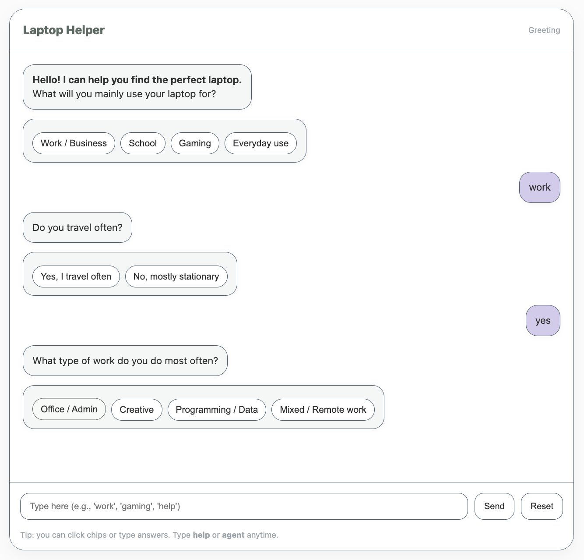
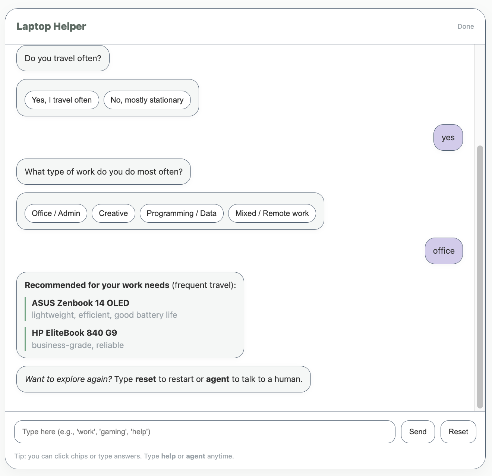
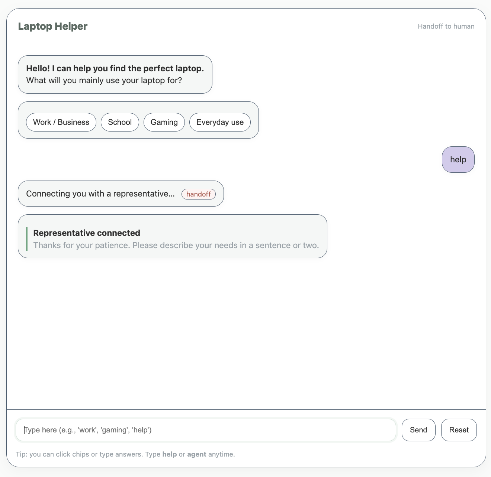
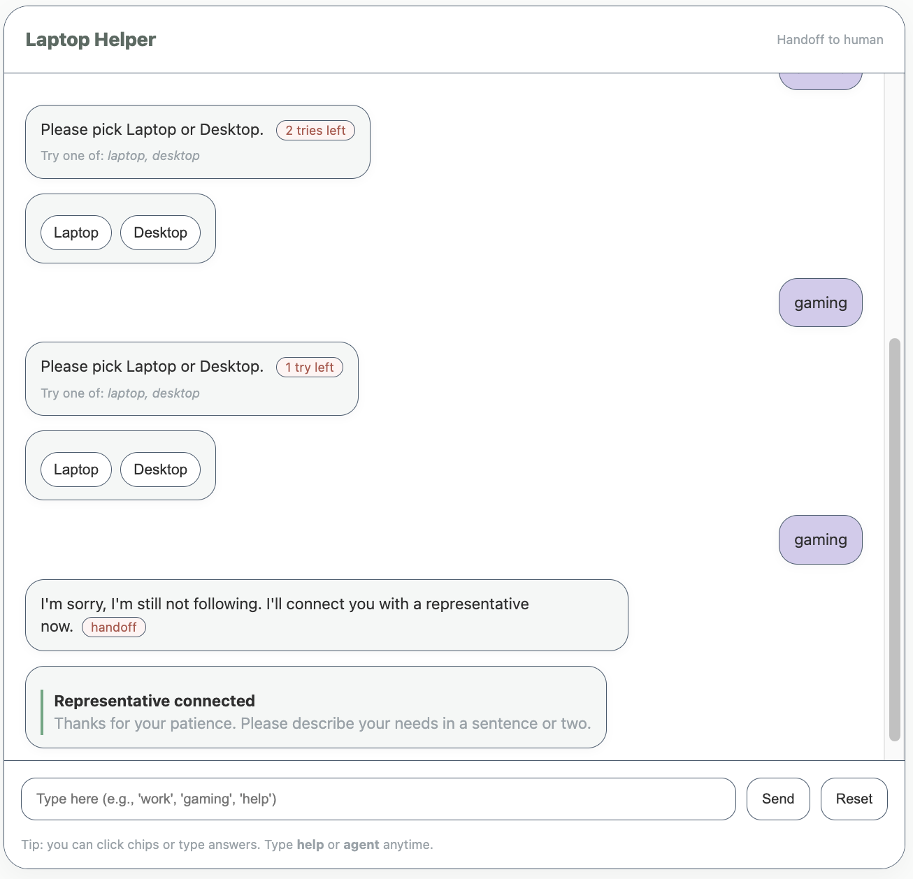
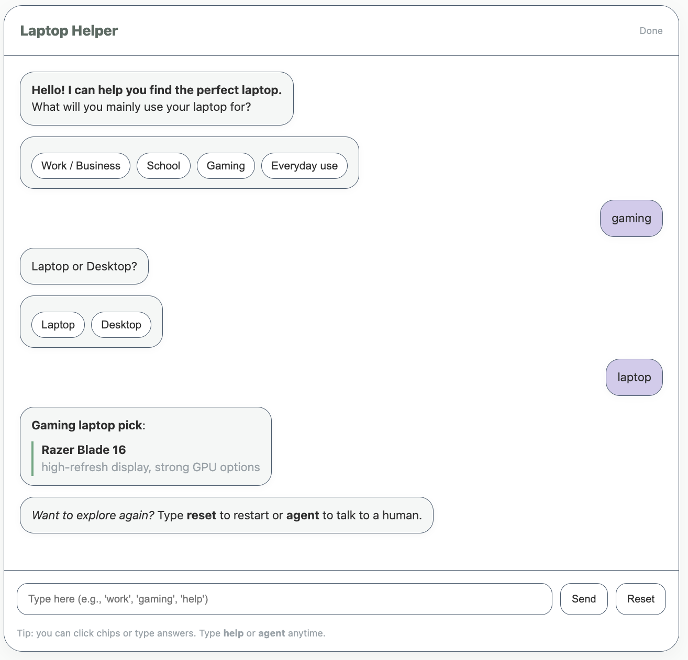

# Laptop Helper Chatbot

## Overview

This is a simple interactive chatbot built with HTML, CSS, and JavaScript. This bot helps users choose the best laptop based on their needs (e.g., work, school, gaming, or everyday use).

## Setup & Installation

There are two ways to run this file. You can clone the repository, or download the HTML file. 

1. Clone Repository
   1. ```powershell
      git clone https://github.com/kylieodonnell/chatbot.git
      cd chatbot
      ```
2. Download File
   1. Simply download the HTML file from this github repository.
3. Running the file:
   1. In your terminal, you can run the file from your terminal by making sure you are in the directory where chatbot.html is in, then running the command: ``open chatbot.html``
   2. You can also run the file by dragging and dropping the file into your browser window.

## How the Chatbot Works

I approached this project by focusing on clarity, flow, and simplicity. The chatbot uses a state-machine structure to guide the user through a logical conversation flow. It always knows what stage of the dialogue it’s in and what to ask next based on previous responses.

The flow goes as follows:

1. Ask the main purpose of the laptop
   * Options: Work, School, Gaming, or Everyday use
2. Work branch:
   * If the user selects “Work,” the chatbot follows up by asking about travel frequency and work type.
3. Gaming branch:
   * If the user selects “Gaming,” it asks whether they prefer a desktop or a laptop.
4. Provide recommendations:
   * After gathering information, the chatbot suggests specific laptop models tailored to the user’s needs.
5. Handle unexpected input:
   * If the user enters something unrecognized:
     * The chatbot provides hints
     * Connects them to a representative after three failed attempts.

This structure keeps the experience lightweight, predictable, and easy to follow while still feeling interactive and conversational.

I also prioritized user experience and design. The chatbot incorporates clear prompts, friendly language, and soft transitions between questions. Visually, it features a clean sage aesthetic creating a calm, modern interface that aligns with minimalist design trends.

## Key Features

* Clean UI built with HTMl/CSS
* Smooth message animation
* Graceful error handling and agent handoff
* Lightweight, no frameworks

## Chatbot in Action! 

Below are some screenshots of the chatbot in action! 

#### Work and travel flow





#### If a user automatically needs help:



#### Error handling after 3x



#### Gaming/laptop flow


